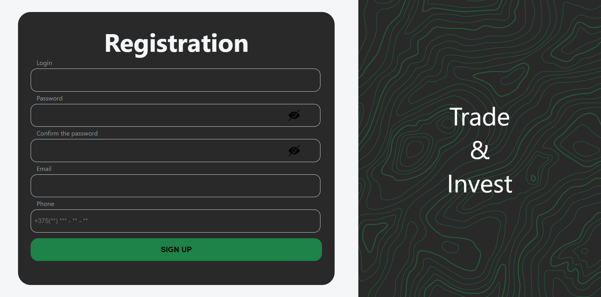
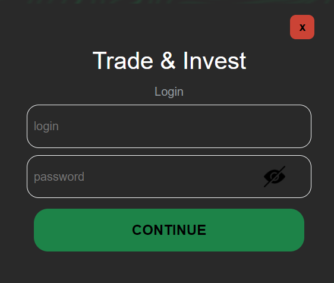

# Trade and Invest

Trade and Invest is a virtual platform, where you can purchase various types of assets (stocks, cryptocurrencies, various currencies).

## Technology

1. React;
2. Redux;
3. Axios;
4. Redux Toolkit;
5. Redux-thunk;
6. Redux-persist;
7. Chart.js;
8. React router;
9. JSON-server;
10. HTML;
11. SASS;

## Description

Проект обладает функциональностью для осуществления покупки/продажи различных активов.

- ### Main page

<p align="center"></p>

На главной странице содержится информация о площадке, инструкция для начала работы и контактная информация. С главной страницы можно перейти на страницу регистрации (SIGN UP) или перейти в свой аккаунт, если он уже зарегистрирован (LOG IN).

- ### Registration

<p align="center"></p>

На станице регистрации осуществляется валидация по всем заполняемым полям. После регистрации на сервере (Json-server) и по адресу http://localhost:3001/profile создается новый пользователь.

- ### Log In

<p align="center"></p>

На этапе логирования осуществляется проверка наличия данного пользователя и корректности введенного пароля. В случае успеха, пользователь попадает на пользовательский аккаунт.

- ### Portfolio

<p align="center"></p>

На данной странице аккаунта выводится информация обо всех активах, имеющихся в портфеле. Круговая диаграмма изменяет пропорции в зависимости от объёма вида актива в портфеле.

- ### Trade

<p align="center"></p>

Данная страница аккаунта содержит 3 вкладки с различными активами (акции, криптовалюты, валюты), курс актива изменяется каждые 5 секунд, также при изменении курса выводится процент увеличения/уменьшения нового курса относительно предыдущего.<br/>
При осуществлении покупки/продажи активов открывается окно содержащую информацию: курс актива, текущий баланс, график изменения курса. В данном окне возможно осуществление выбора необходимого количества актива для покупки/продажи, в случае недостаточности валюты Система не позволит осуществить операцию.

- ### Wallet

<p align="center"></p>

На данной странице аккаунта возможно пополнение или вывод средств в различных валютах, в дальнейшем за эти средства возможно осуществление торговли. В Системе имеется контроль на вывод средств, нет возможности вывести средств больше чем числится на аккаунте.

- ### Profile

<p align="center"></p>

На странице профиля выводится информация о пользователе, на карточке пользователя имеется возможность изменение данных и пароля, все необходимые валидации имеются в Системе.

- ### Help

<p align="center"></p>

На станице помощи имеется возможность отправки сообщения на сервер, информация попадает по адресу http://localhost:3001/help. Объект на сервере сожержит: id, login, title, text.

- ### Json-server

<p align="center"></p>

На порту http://localhost:3001 разворачивается json-server, имеющий 2 эндпоита profile и help, на данный сервер попадает вся информация из площадки Trade&Invest.

## Getting Started

Для запуска проекта необходимо: 

1. Клонировать репозиторий к себе (средствами git или архивом);
    ```
   git clone https://github.com/NikitaMih/tradeinvest.git
    ```
2. Установить взаимосвязи и необходимые библиотеки;
    ```
   npm i
    ```
3. Перейти в директорию с сервером (\tradeinvest\json-server) и выполнить команду (после выполнения команды на потру http://localhost:3001 развернется json-server):
    ```
   npm start
    ```  
или скрипт (babel-node -- src/cli/bin db.json -r routes.json--port 3001)

4. Перейти в директорию с проектом (\tradeinvest)  и выполнить команду:
    ```
   npm start
    ``` 
    
или скрипт (react-scripts start)