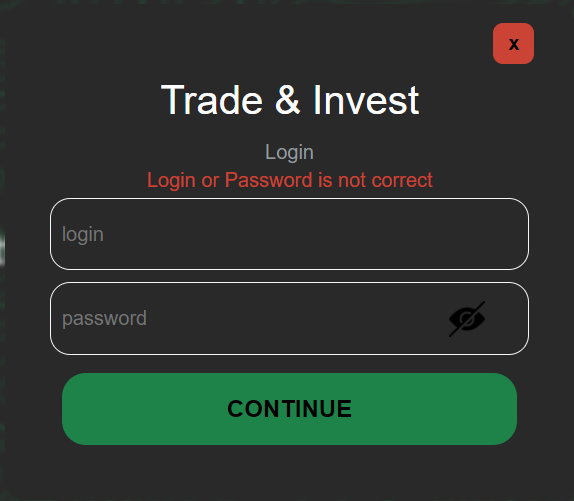
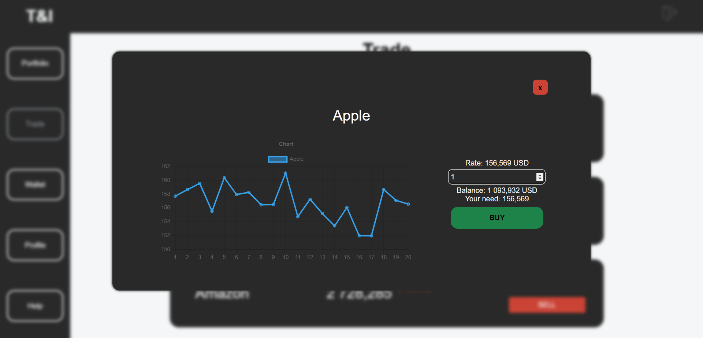

# Trade and Invest

Trade and Invest is a virtual platform, where you can purchase various types of assets (stocks, cryptocurrencies, various currencies).

## Technology

1. React;
2. Redux;
3. Axios;
4. Redux Toolkit;
5. Redux-thunk;
6. Redux-persist;
7. Chart.js;
8. React router;
9. JSON-server;
10. HTML;
11. SASS;

## Description

Проект обладает функциональностью для осуществления покупки/продажи различных активов.

- ### Main page

<p align="center"></p>

На главной странице содержится информация о площадке, инструкция для начала работы и контактная информация. С главной страницы можно перейти на страницу регистрации (SIGN UP) или перейти в свой аккаунт, если он уже зарегистрирован (LOG IN).

- ### Registration

<p align="center"></p>

На станице регистрации осуществляется валидация по всем заполняемым полям. После регистрации на сервере (Json-server) и по адресу http://localhost:3001/profile создается новый пользователь.

- ### Log In

<p align="center"></p>

На этапе авторизации осуществляется проверка существования пользователя и корректности введенного пароля.

- ### Portfolio

<p align="center"></p>

На данной странице аккаунта выводится информация обо всех активах, имеющихся в портфеле. Круговая диаграмма изменяет пропорции в зависимости от объёма активов в портфеле.

- ### Trade

<p align="center"></p>

Данная страница аккаунта содержит 3 вкладки с различными активами (акции, криптовалюты, валюты). Курс актива изменяется каждые 5 секунд, также при изменении курса выводится темп прироста.<br/>
При осуществлении покупки/продажи активов открывается окно со следующей информацией: курс актива, текущий баланс, график изменения курса. В данном окне возможно осуществление выбора необходимого количества актива для покупки/продажи. В случае отсутствия необходимого количества валюты система не позволит осуществить операцию.

- ### Wallet

<p align="center"></p>

На данной странице аккаунта возможно пополнение или вывод средств в различных валютах. В дальнейшем за эти средства возможно осуществление торговли. В Системе имеется контроль на вывод средств: нет возможности вывести средств больше, чем числится на аккаунте.

- ### Profile

<p align="center"></p>

На странице профиля выводится информация о пользователе. На карточке пользователя имеется возможность изменения данных пользователя.

- ### Help

<p align="center"></p>

На станице помощи имеется возможность отправки сообщений на сервер (http://localhost:3001/help). Объект на сервере сожержит следующие атрибуты: id, login, title, text.

- ### Json-server

На порту http://localhost:3001 разворачивается json-server, имеющий 2 эндпоита: profile и help. На данный сервер попадает вся информация из площадки Trade&Invest.

http://localhost:3001/profile - содержит информацию о зарегистрированных пользователях.
http://localhost:3001/help - содержит информацию о сообщениях, отправленных с аккаунтов.


## Getting Started

Для запуска проекта необходимо: 

1. Клонировать репозиторий к себе (средствами git или архивом);
    ```
   git clone https://github.com/NikitaMih/tradeinvest.git
    ```
2. Установить взаимосвязи и необходимые библиотеки;
    ```
   npm i
    ```
3. Установить json-server, если ранее не был установлен;
    ```
   npm install -g json-server
    ```
4. Выполнить команду (после выполнения команды, на порту http://localhost:3000 развернется проект);
    ```
   npm start
    ```  
5. Для запуска сервера выполнить скрипт в другом терминале;
    ```
   json-server --watch db.json --port 3001
    ```  
После выполнения на порту http://localhost:3001 развернется json-server.